[Pycharm官方下载页](https://www.jetbrains.com/pycharm/download/#section=windows)

[Pycharm Professional 2020.1.2 win10-x64 安装包](https://download.jetbrains.8686c.com/python/pycharm-professional-2020.1.2.exe)

[TabNine插件下载页](https://plugins.jetbrains.com/plugin/12798-tabnine/versions)

[TabNine-0.1.11.zip](TabNine-0.1.11.zip)

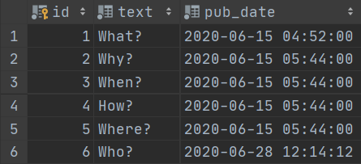
---
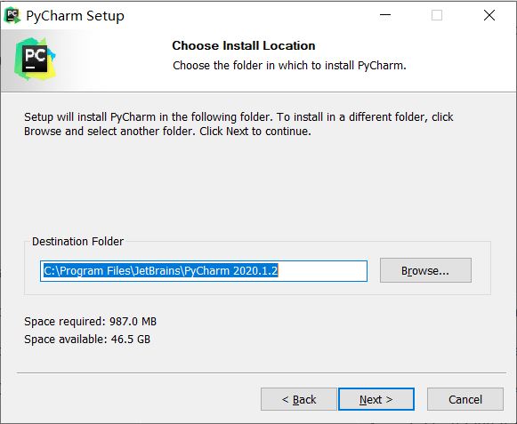
---
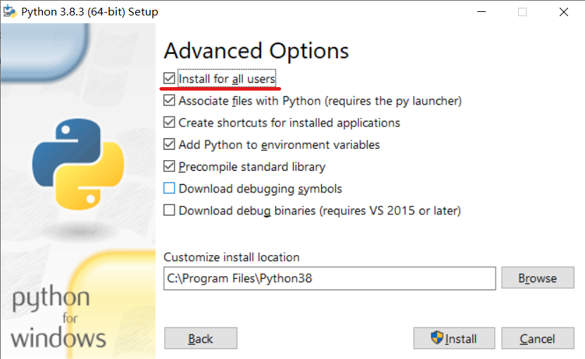
---
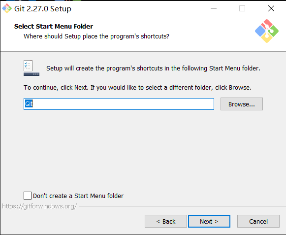
---
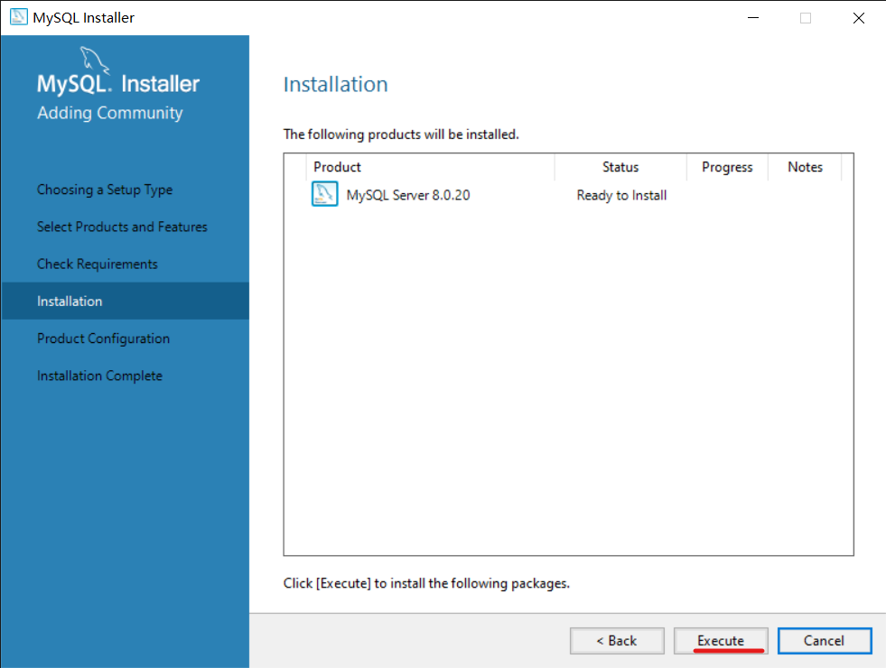
---
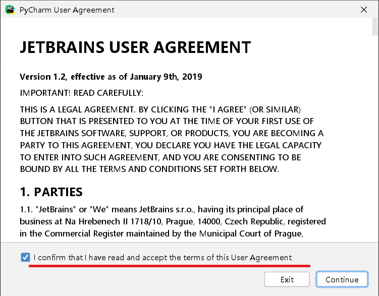
---
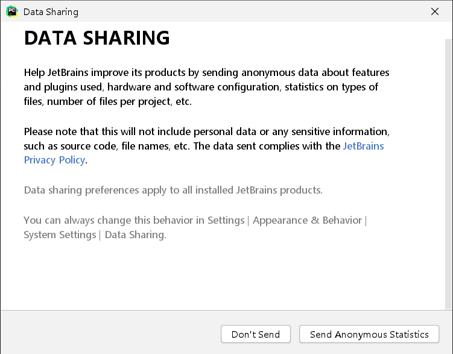
---
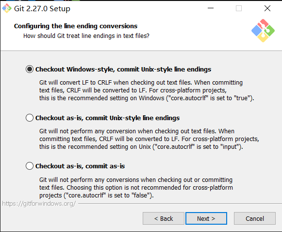
---
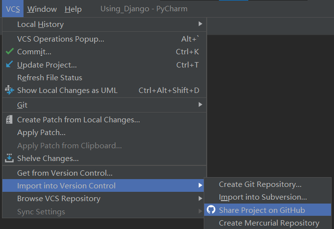
---
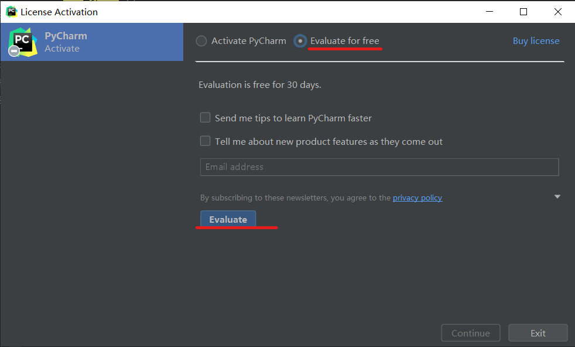
---
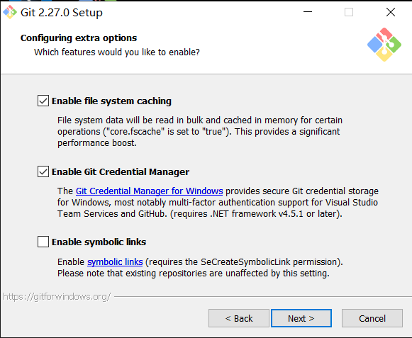
---
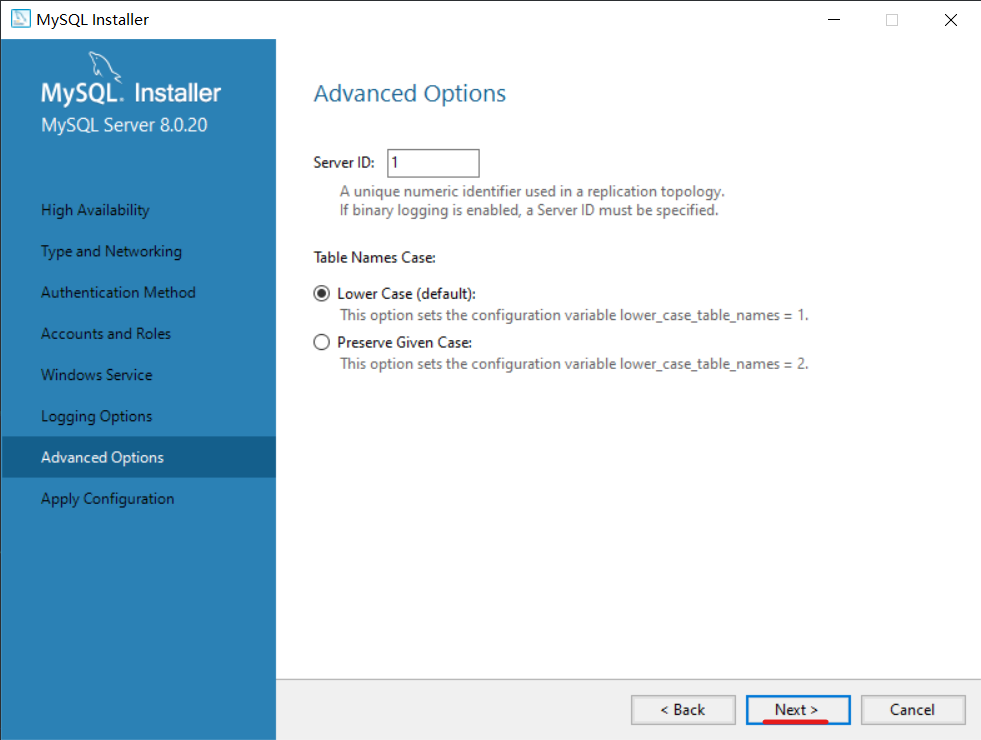
---
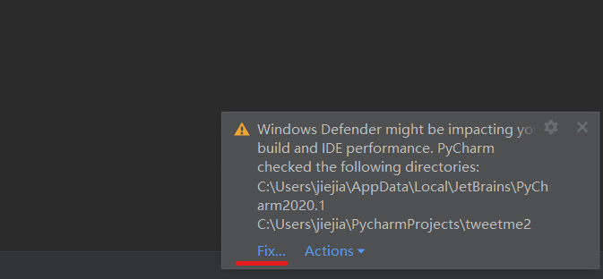
---
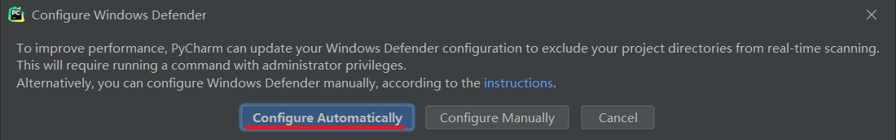
---

---

---
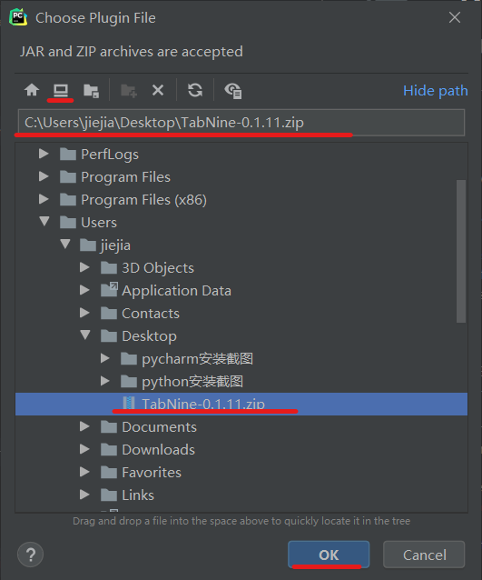
---
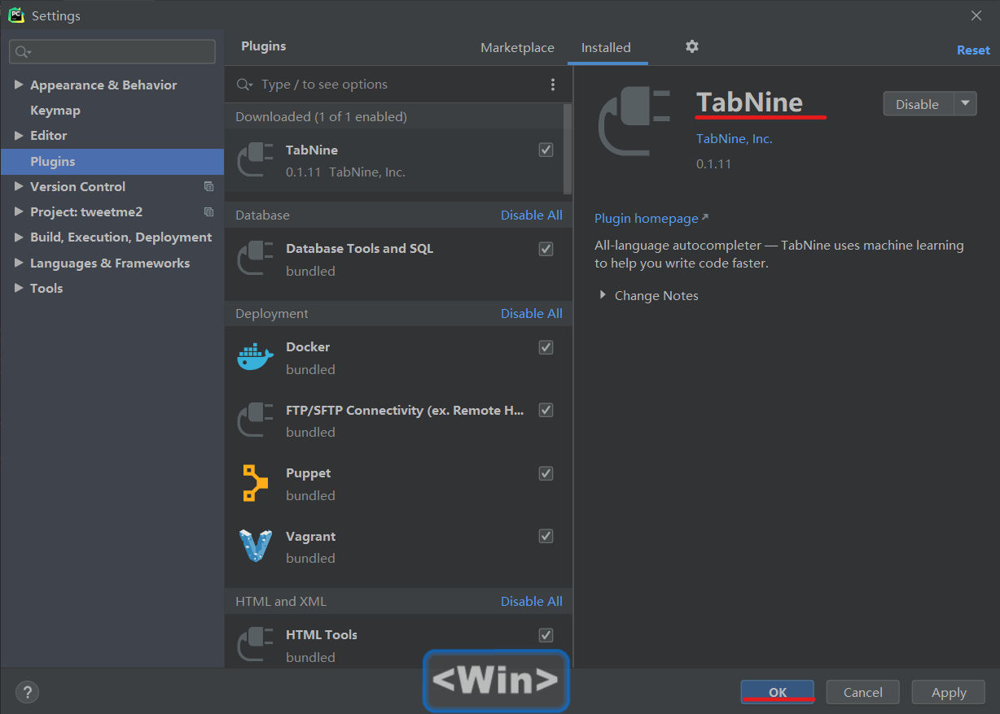
---

---

---